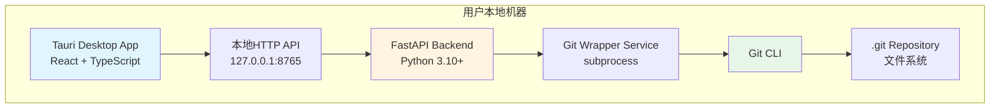

# 设计文档: Chronos MVP

## 概述

Chronos采用前后端分离的客户端-服务器架构，所有组件都运行在用户的本地机器上。Frontend使用Tauri + React构建原生桌面应用，Backend使用Python + FastAPI提供本地HTTP API服务。核心版本控制功能通过封装Git CLI命令实现，确保可靠性和兼容性。

### 设计目标

1. **简单易用**: 为非技术用户提供直观的图形界面，隐藏Git的复杂性
2. **本地优先**: 所有数据和操作都在本地完成，无需网络连接
3. **高性能**: 快速响应用户操作，满足MVP性能目标
4. **可扩展**: 清晰的架构分层，便于后续功能扩展

## 架构

### 系统架构图



### 架构层次

1. **表现层 (Presentation Layer)**: Tauri/React GUI
   - 负责所有用户界面渲染和交互
   - 使用Ant Design组件库保证UI一致性
   - 通过HTTP客户端与Backend通信

2. **API层 (API Layer)**: FastAPI路由
   - 定义RESTful API端点
   - 处理请求验证和响应格式化
   - 统一错误处理

3. **业务逻辑层 (Business Logic Layer)**: Service层
   - Git命令封装和执行
   - 输出解析和数据转换
   - 业务规则实现

4. **数据层 (Data Layer)**: Git仓库
   - 使用Git作为版本控制引擎
   - 所有版本数据存储在.git目录

## 组件和接口

### Backend组件

#### 1. API路由模块 (api/)

**repository.py** - 仓库操作
```python
POST /repository/init
  请求: {"path": "/absolute/path/to/folder"}
  响应: {"success": true, "data": {"message": "仓库初始化成功"}}

GET /repository/status
  参数: repo_path=/absolute/path
  响应: {
    "success": true,
    "data": {
      "branch": "main",
      "changes": [
        {"status": "A", "file": "新文件.doc"},
        {"status": "M", "file": "修改文件.doc"}
      ]
    }
  }
```

**commit.py** - 快照操作
```python
POST /repository/commit
  参数: repo_path=/absolute/path
  请求: {
    "message": "feat: 完成第一章",
    "files_to_add": ["文件1.doc", "文件2.doc"]
  }
  响应: {"success": true, "data": {"message": "快照创建成功"}}

GET /repository/log
  参数: repo_path=/absolute/path
  响应: {
    "success": true,
    "data": {
      "logs": [
        {
          "id": "a1b2c3d",
          "message": "feat: 完成第一章",
          "author": "用户名",
          "date": "2025-10-20T10:30:00"
        }
      ]
    }
  }

POST /repository/checkout
  参数: repo_path=/absolute/path
  请求: {"commit_id": "a1b2c3d"}
  响应: {"success": true, "data": {"message": "回滚成功"}}
```

**branch.py** - 分支操作
```python
GET /repository/branches
  参数: repo_path=/absolute/path
  响应: {
    "success": true,
    "data": {
      "branches": ["main", "feature-branch"],
      "current": "main"
    }
  }

POST /repository/branch
  参数: repo_path=/absolute/path
  请求: {"name": "new-branch"}
  响应: {"success": true, "data": {"message": "分支创建成功"}}

POST /repository/switch
  参数: repo_path=/absolute/path
  请求: {"branch": "feature-branch"}
  响应: {"success": true, "data": {"message": "切换分支成功"}}

POST /repository/merge
  参数: repo_path=/absolute/path
  请求: {"source_branch": "feature-branch", "target_branch": "main"}
  响应: {"success": true, "data": {"message": "合并成功", "conflicts": []}}
```

#### 2. Git封装服务 (services/git_wrapper.py)

核心服务类，负责执行Git命令并解析输出：

```python
class GitWrapper:
    def __init__(self, repo_path: str):
        self.repo_path = repo_path
    
    def init_repository(self) -> dict:
        """初始化Git仓库"""
        # 执行: git init
        # 创建: .chronos配置文件
        
    def get_status(self) -> dict:
        """获取仓库状态"""
        # 执行: git status --porcelain
        # 执行: git branch --show-current
        # 解析并返回结构化数据
        
    def create_commit(self, message: str, files: list) -> dict:
        """创建提交"""
        # 执行: git add <files>
        # 执行: git commit -m <message>
        
    def get_log(self, limit: int = 100) -> list:
        """获取提交历史"""
        # 执行: git log --pretty=format:"%h|%s|%an|%aI" -n <limit>
        # 解析每一行并返回列表
        
    def checkout_commit(self, commit_id: str) -> dict:
        """回滚到指定提交"""
        # 执行: git checkout <commit_id> -- .
        
    def get_branches(self) -> dict:
        """获取所有分支"""
        # 执行: git branch
        # 解析并标识当前分支
        
    def create_branch(self, name: str) -> dict:
        """创建新分支"""
        # 执行: git branch <name>
        # 执行: git switch <name>
        
    def switch_branch(self, name: str) -> dict:
        """切换分支"""
        # 执行: git switch <name>
        
    def merge_branch(self, source: str, target: str) -> dict:
        """合并分支"""
        # 执行: git switch <target>
        # 执行: git merge <source>
        # 检测冲突并返回结果
```

**关键实现细节**:
- 使用`subprocess.run()`执行Git命令
- 设置`cwd=repo_path`确保在正确的目录执行
- 使用`capture_output=True, text=True`捕获输出
- 检查`returncode`判断命令是否成功
- 解析`stdout`和`stderr`提取信息

#### 3. 数据模型 (models/)

使用Pydantic定义请求和响应模型：

```python
# models/repository.py
class InitRequest(BaseModel):
    path: str

class CommitRequest(BaseModel):
    message: str
    files_to_add: list[str] = []

class BranchRequest(BaseModel):
    name: str

class SwitchRequest(BaseModel):
    branch: str

class MergeRequest(BaseModel):
    source_branch: str
    target_branch: str

# models/response.py
class ApiResponse(BaseModel):
    success: bool
    data: dict | None = None
    error: str | None = None

class FileChange(BaseModel):
    status: str  # 'A', 'M', 'D'
    file: str

class CommitLog(BaseModel):
    id: str
    message: str
    author: str
    date: str
```

### Frontend组件

#### 1. API客户端 (api/client.ts)

封装所有Backend API调用：

```typescript
class ChronosApiClient {
  private baseUrl = 'http://127.0.0.1:8765';
  
  async initRepository(path: string): Promise<ApiResponse> {
    // POST /repository/init
  }
  
  async getStatus(repoPath: string): Promise<StatusResponse> {
    // GET /repository/status
  }
  
  async createCommit(repoPath: string, message: string, files: string[]): Promise<ApiResponse> {
    // POST /repository/commit
  }
  
  async getLog(repoPath: string): Promise<LogResponse> {
    // GET /repository/log
  }
  
  async checkoutCommit(repoPath: string, commitId: string): Promise<ApiResponse> {
    // POST /repository/checkout
  }
  
  async getBranches(repoPath: string): Promise<BranchesResponse> {
    // GET /repository/branches
  }
  
  async createBranch(repoPath: string, name: string): Promise<ApiResponse> {
    // POST /repository/branch
  }
  
  async switchBranch(repoPath: string, branch: string): Promise<ApiResponse> {
    // POST /repository/switch
  }
  
  async mergeBranch(repoPath: string, source: string, target: string): Promise<ApiResponse> {
    // POST /repository/merge
  }
}
```

#### 2. React组件

**SnapshotDialog.tsx** - 创建快照对话框
- 显示变更文件列表
- 文件选择（全选/取消全选）
- 快照描述输入（必填）
- 可选的详细描述
- 确认/取消按钮

**HistoryViewer.tsx** - 历史查看器
- 垂直时间线显示所有快照
- 每个快照显示：ID、描述、作者、时间
- 点击快照显示文件变更详情
- "恢复到此版本"按钮
- 空状态提示

**BranchManager.tsx** - 分支管理器
- 分支下拉选择器
- 显示当前分支
- 创建新分支按钮
- 切换分支功能
- "合并到主版本"按钮（非主分支时显示）

**App.tsx** - 主应用组件
- 路由管理
- 全局状态管理
- 错误边界处理

#### 3. 自定义Hooks

```typescript
// hooks/useRepository.ts
function useRepository(repoPath: string) {
  const [status, setStatus] = useState<StatusData | null>(null);
  const [loading, setLoading] = useState(false);
  
  const refreshStatus = async () => {
    // 获取仓库状态
  };
  
  return { status, loading, refreshStatus };
}

// hooks/useHistory.ts
function useHistory(repoPath: string) {
  const [logs, setLogs] = useState<CommitLog[]>([]);
  const [loading, setLoading] = useState(false);
  
  const refreshHistory = async () => {
    // 获取历史记录
  };
  
  return { logs, loading, refreshHistory };
}

// hooks/useBranches.ts
function useBranches(repoPath: string) {
  const [branches, setBranches] = useState<string[]>([]);
  const [currentBranch, setCurrentBranch] = useState<string>('');
  
  const refreshBranches = async () => {
    // 获取分支列表
  };
  
  return { branches, currentBranch, refreshBranches };
}
```

## 数据模型

### Git状态映射

Git的文件状态码需要标准化为用户友好的格式：

```python
STATUS_MAP = {
    'A': 'added',      # 新增
    'M': 'modified',   # 修改
    'D': 'deleted',    # 删除
    '??': 'added',     # 未跟踪文件视为新增
    'R': 'renamed',    # 重命名
}
```

### 配置文件格式

`.chronos`配置文件（JSON格式）：

```json
{
  "version": "1.0",
  "created_at": "2025-10-20T10:00:00",
  "user": {
    "name": "用户名",
    "email": "user@example.com"
  },
  "settings": {
    "auto_stage": true,
    "default_branch": "main"
  }
}
```

## 错误处理

### Backend错误处理策略

1. **Git命令执行失败**
   - 捕获`subprocess`异常
   - 解析`stderr`获取错误信息
   - 返回友好的中文错误消息

2. **路径验证**
   - 检查路径是否存在
   - 检查是否有读写权限
   - 检查是否已是Git仓库

3. **冲突处理**
   - 检测合并冲突
   - 返回冲突文件列表
   - 提供解决建议

```python
class GitError(Exception):
    """Git操作错误基类"""
    pass

class RepositoryNotFoundError(GitError):
    """仓库不存在"""
    pass

class InvalidPathError(GitError):
    """无效路径"""
    pass

class MergeConflictError(GitError):
    """合并冲突"""
    def __init__(self, conflicts: list):
        self.conflicts = conflicts
```

### Frontend错误处理

1. **API调用失败**
   - 显示错误通知（Ant Design Message组件）
   - 记录错误日志
   - 提供重试选项

2. **用户输入验证**
   - 实时验证表单输入
   - 显示验证错误提示
   - 禁用无效操作

3. **加载状态管理**
   - 显示加载指示器
   - 禁用重复操作
   - 超时处理

## 测试策略

### Backend测试

**单元测试 (Pytest)**

1. **Git Wrapper测试**
   - 模拟Git命令输出
   - 测试输出解析逻辑
   - 测试错误处理

```python
def test_parse_status_output():
    """测试状态输出解析"""
    output = " M file1.txt\nA  file2.txt\n"
    result = parse_status(output)
    assert len(result) == 2
    assert result[0]['status'] == 'modified'

def test_init_repository_success():
    """测试仓库初始化成功"""
    wrapper = GitWrapper('/tmp/test')
    result = wrapper.init_repository()
    assert result['success'] == True

def test_init_repository_already_exists():
    """测试重复初始化"""
    # 测试已存在仓库的情况
```

2. **API端点测试**
   - 使用TestClient测试FastAPI端点
   - 测试请求验证
   - 测试响应格式

```python
def test_init_endpoint():
    """测试初始化API端点"""
    response = client.post("/repository/init", json={"path": "/tmp/test"})
    assert response.status_code == 200
    assert response.json()['success'] == True
```

### Frontend测试

**组件测试 (Vitest + React Testing Library)**

1. **组件渲染测试**
   - 测试组件正确渲染
   - 测试条件渲染
   - 测试空状态

```typescript
test('SnapshotDialog renders correctly', () => {
  render(<SnapshotDialog open={true} changes={mockChanges} />);
  expect(screen.getByText('创建快照')).toBeInTheDocument();
});

test('HistoryViewer shows empty state', () => {
  render(<HistoryViewer logs={[]} />);
  expect(screen.getByText('创建第一个快照')).toBeInTheDocument();
});
```

2. **用户交互测试**
   - 测试按钮点击
   - 测试表单输入
   - 测试API调用

```typescript
test('creates snapshot on confirm', async () => {
  const onConfirm = vi.fn();
  render(<SnapshotDialog open={true} onConfirm={onConfirm} />);
  
  await userEvent.type(screen.getByLabelText('描述'), 'test commit');
  await userEvent.click(screen.getByText('确认创建'));
  
  expect(onConfirm).toHaveBeenCalledWith('test commit', []);
});
```

3. **Hook测试**
   - 测试自定义Hook逻辑
   - 测试状态更新
   - 测试副作用

### 集成测试

1. **端到端流程测试**
   - 初始化仓库 → 创建快照 → 查看历史 → 回滚
   - 创建分支 → 切换分支 → 合并分支

2. **性能测试**
   - 测试大文件夹初始化时间
   - 测试多文件状态检查时间
   - 测试历史记录加载时间

## 性能优化

### Backend优化

1. **命令执行优化**
   - 使用`--porcelain`格式化输出，便于解析
   - 限制`git log`返回数量
   - 使用`--no-pager`避免分页

2. **并发处理**
   - 使用异步API（FastAPI原生支持）
   - 避免阻塞操作

3. **缓存策略**
   - 缓存分支列表（短时间内）
   - 缓存仓库配置

### Frontend优化

1. **懒加载**
   - 历史记录分页加载
   - 文件变更详情按需加载

2. **防抖和节流**
   - 搜索输入防抖
   - 状态刷新节流

3. **状态管理**
   - 使用React Query管理服务器状态
   - 避免不必要的重新渲染

## 安全考虑

1. **路径验证**
   - 验证路径格式
   - 防止路径遍历攻击
   - 限制操作范围

2. **命令注入防护**
   - 使用列表形式传递命令参数
   - 避免字符串拼接
   - 验证所有用户输入

3. **权限检查**
   - 检查文件系统权限
   - 处理权限不足错误

## 部署和配置

### Backend启动

```bash
cd claudedev/backend
python -m uvicorn main:app --host 127.0.0.1 --port 8765
```

### Frontend启动

```bash
cd claudedev/frontend
npm run dev
```

### 生产构建

```bash
cd claudedev/frontend
npm run build
```

Tauri会将Backend和Frontend打包成单一的原生应用程序。
