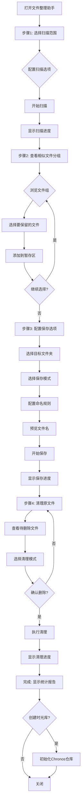

# 文件整理助手 - 设计文档

## 概述

文件整理助手是Chronos v2.0的一个独立功能模块，通过智能算法识别相似文件，提供可视化的交互界面，帮助用户高效整理历史存量文件。本设计文档详细描述了系统架构、组件设计、数据模型、算法实现和用户交互流程。

## 架构设计

### 系统架构

```
┌─────────────────────────────────────────────────────────┐
│                    Presentation Layer                    │
│  ┌──────────────┐  ┌──────────────┐  ┌──────────────┐  │
│  │ FileOrganizer│  │ ScanWizard   │  │ ResultViewer │  │
│  │   Page       │  │  Component   │  │  Component   │  │
│  └──────────────┘  └──────────────┘  └──────────────┘  │
└─────────────────────────────────────────────────────────┘
                            ↓
┌─────────────────────────────────────────────────────────┐
│                   Application Layer                      │
│  ┌──────────────┐  ┌──────────────┐  ┌──────────────┐  │
│  │ useOrganizer │  │ useSimilarity│  │ useStaging   │  │
│  │   Hook       │  │    Hook      │  │    Hook      │  │
│  └──────────────┘  └──────────────┘  └──────────────┘  │
└─────────────────────────────────────────────────────────┘
                            ↓
┌─────────────────────────────────────────────────────────┐
│                     Service Layer                        │
│  ┌──────────────┐  ┌──────────────┐  ┌──────────────┐  │
│  │ Organizer    │  │ Similarity   │  │ File         │  │
│  │  Service     │  │  Service     │  │ Service      │  │
│  └──────────────┘  └──────────────┘  └──────────────┘  │
└─────────────────────────────────────────────────────────┘
                            ↓
┌─────────────────────────────────────────────────────────┐
│                  Infrastructure Layer                    │
│  ┌──────────────┐  ┌──────────────┐  ┌──────────────┐  │
│  │ File System  │  │ Database     │  │ Logger       │  │
│  │  (Node.js)   │  │  (SQLite)    │  │  Service     │  │
│  └──────────────┘  └──────────────┘  └──────────────┘  │
└─────────────────────────────────────────────────────────┘
```

### 模块划分

1. **前端模块** (`src/client/src/`)
   - `pages/FileOrganizerPage.tsx` - 主页面
   - `components/organizer/` - 组件目录
   - `hooks/useOrganizer.ts` - 业务逻辑Hook
   - `stores/organizer-store.ts` - 状态管理

2. **后端模块** (`src/server/`)
   - `routes/organizer.ts` - API路由
   - `services/organizer-service.ts` - 业务逻辑
   - `services/similarity-service.ts` - 相似度计算
   - `utils/file-scanner.ts` - 文件扫描工具

3. **共享模块** (`src/shared/`)
   - `types/organizer.ts` - 类型定义
   - `constants/organizer.ts` - 常量定义


## 数据模型

### 核心数据结构

```typescript
// 文件信息
interface FileInfo {
  id: string;                    // 唯一标识
  path: string;                  // 文件完整路径
  name: string;                  // 文件名
  extension: string;             // 文件扩展名
  size: number;                  // 文件大小（字节）
  createdAt: Date;              // 创建时间
  modifiedAt: Date;             // 修改时间
  type: FileType;               // 文件类型
  status: FileStatus;           // 文件状态
}

// 文件类型
enum FileType {
  DOCUMENT = 'document',        // 文档
  IMAGE = 'image',              // 图片
  SPREADSHEET = 'spreadsheet',  // 表格
  ARCHIVE = 'archive',          // 压缩包
  OTHER = 'other'               // 其他
}

// 文件状态
enum FileStatus {
  UNPROCESSED = 'unprocessed',  // 未处理
  STAGED = 'staged',            // 已暂存
  TO_DELETE = 'to_delete',      // 待删除
  PROCESSED = 'processed'       // 已处理
}

// 文件组
interface FileGroup {
  id: string;                   // 组ID
  files: FileInfo[];            // 文件列表
  similarity: number;           // 相似度（0-100）
  representative: FileInfo;     // 代表文件（最新的）
}

// 扫描配置
interface ScanConfig {
  sourcePath: string;           // 源文件夹路径
  includeSubfolders: boolean;   // 包含子文件夹
  ignoreSystemFiles: boolean;   // 忽略系统文件
  fileTypesFilter?: string[];   // 文件类型过滤
}

// 保存配置
interface SaveConfig {
  targetPath: string;           // 目标文件夹路径
  mode: SaveMode;               // 保存模式
  namingRule: NamingRule;       // 命名规则
  prefix?: string;              // 文件名前缀
}

// 保存模式
enum SaveMode {
  COPY = 'copy',                // 复制
  MOVE = 'move'                 // 移动
}

// 命名规则
enum NamingRule {
  KEEP_ORIGINAL = 'keep_original',  // 保持原名
  UNIFIED_RENAME = 'unified_rename' // 统一重命名
}

// 清理配置
interface CleanupConfig {
  mode: CleanupMode;            // 清理模式
  archivePath?: string;         // 归档路径
}

// 清理模式
enum CleanupMode {
  PERMANENT_DELETE = 'permanent_delete',  // 永久删除
  MOVE_TO_TRASH = 'move_to_trash',        // 移动到回收站
  MOVE_TO_ARCHIVE = 'move_to_archive'     // 移动到归档
}

// 整理会话
interface OrganizerSession {
  id: string;                   // 会话ID
  scanConfig: ScanConfig;       // 扫描配置
  scannedFiles: FileInfo[];     // 扫描到的文件
  fileGroups: FileGroup[];      // 文件分组
  stagingArea: FileInfo[];      // 暂存区
  saveConfig?: SaveConfig;      // 保存配置
  cleanupConfig?: CleanupConfig;// 清理配置
  statistics: Statistics;       // 统计信息
  createdAt: Date;              // 创建时间
  status: SessionStatus;        // 会话状态
}

// 会话状态
enum SessionStatus {
  SCANNING = 'scanning',        // 扫描中
  GROUPING = 'grouping',        // 分组中
  REVIEWING = 'reviewing',      // 审查中
  SAVING = 'saving',            // 保存中
  CLEANING = 'cleaning',        // 清理中
  COMPLETED = 'completed',      // 已完成
  CANCELLED = 'cancelled'       // 已取消
}

// 统计信息
interface Statistics {
  totalFiles: number;           // 总文件数
  totalGroups: number;          // 总分组数
  stagedFiles: number;          // 暂存文件数
  deletedFiles: number;         // 删除文件数
  savedSpace: number;           // 节省空间（字节）
}
```


## 核心算法

### 相似度计算算法

```typescript
/**
 * 计算两个文件的相似度
 * @param file1 第一个文件
 * @param file2 第二个文件
 * @returns 相似度分数 (0-100)
 */
function calculateSimilarity(file1: FileInfo, file2: FileInfo): number {
  // 1. 文件名相似度（权重60%）
  const nameSimilarity = calculateNameSimilarity(file1.name, file2.name);
  
  // 2. 文件大小接近度（权重20%）
  const sizeSimilarity = calculateSizeSimilarity(file1.size, file2.size);
  
  // 3. 修改时间接近度（权重20%）
  const timeSimilarity = calculateTimeSimilarity(
    file1.modifiedAt,
    file2.modifiedAt
  );
  
  // 加权平均
  return nameSimilarity * 0.6 + sizeSimilarity * 0.2 + timeSimilarity * 0.2;
}

/**
 * 计算文件名相似度（使用Levenshtein距离）
 */
function calculateNameSimilarity(name1: string, name2: string): number {
  // 移除扩展名
  const base1 = removeExtension(name1);
  const base2 = removeExtension(name2);
  
  // 标准化（转小写、移除特殊字符）
  const normalized1 = normalize(base1);
  const normalized2 = normalize(base2);
  
  // 计算Levenshtein距离
  const distance = levenshteinDistance(normalized1, normalized2);
  const maxLength = Math.max(normalized1.length, normalized2.length);
  
  // 转换为相似度（0-100）
  return ((maxLength - distance) / maxLength) * 100;
}

/**
 * 计算文件大小接近度
 */
function calculateSizeSimilarity(size1: number, size2: number): number {
  if (size1 === 0 || size2 === 0) return 0;
  
  const diff = Math.abs(size1 - size2);
  const max = Math.max(size1, size2);
  
  // 差异小于10%认为相似
  return Math.max(0, (1 - diff / max)) * 100;
}

/**
 * 计算修改时间接近度
 */
function calculateTimeSimilarity(time1: Date, time2: Date): number {
  const diffMs = Math.abs(time1.getTime() - time2.getTime());
  const diffDays = diffMs / (1000 * 60 * 60 * 24);
  
  // 时间差越小越相似，使用指数衰减
  // 0天=100分，7天=50分，30天=10分
  return Math.max(0, 100 * Math.exp(-diffDays / 10));
}

/**
 * Levenshtein距离算法
 */
function levenshteinDistance(str1: string, str2: string): number {
  const m = str1.length;
  const n = str2.length;
  const dp: number[][] = Array(m + 1).fill(null).map(() => Array(n + 1).fill(0));
  
  for (let i = 0; i <= m; i++) dp[i][0] = i;
  for (let j = 0; j <= n; j++) dp[0][j] = j;
  
  for (let i = 1; i <= m; i++) {
    for (let j = 1; j <= n; j++) {
      if (str1[i - 1] === str2[j - 1]) {
        dp[i][j] = dp[i - 1][j - 1];
      } else {
        dp[i][j] = Math.min(
          dp[i - 1][j] + 1,      // 删除
          dp[i][j - 1] + 1,      // 插入
          dp[i - 1][j - 1] + 1   // 替换
        );
      }
    }
  }
  
  return dp[m][n];
}
```

### 文件分组算法

```typescript
/**
 * 将文件列表分组
 * @param files 文件列表
 * @param threshold 相似度阈值（默认80）
 * @returns 文件分组列表
 */
function groupFiles(files: FileInfo[], threshold: number = 80): FileGroup[] {
  const groups: FileGroup[] = [];
  const processed = new Set<string>();
  
  for (let i = 0; i < files.length; i++) {
    if (processed.has(files[i].id)) continue;
    
    const group: FileInfo[] = [files[i]];
    processed.add(files[i].id);
    
    for (let j = i + 1; j < files.length; j++) {
      if (processed.has(files[j].id)) continue;
      
      const similarity = calculateSimilarity(files[i], files[j]);
      
      if (similarity >= threshold) {
        group.push(files[j]);
        processed.add(files[j].id);
      }
    }
    
    // 只有包含2个以上文件的才算一组
    if (group.length >= 2) {
      // 找出最新的文件作为代表
      const representative = group.reduce((latest, file) =>
        file.modifiedAt > latest.modifiedAt ? file : latest
      );
      
      // 计算组内平均相似度
      const avgSimilarity = calculateGroupSimilarity(group);
      
      groups.push({
        id: generateId(),
        files: group.sort((a, b) => b.modifiedAt.getTime() - a.modifiedAt.getTime()),
        similarity: avgSimilarity,
        representative
      });
    }
  }
  
  // 按相似度降序排序
  return groups.sort((a, b) => b.similarity - a.similarity);
}

/**
 * 计算组内平均相似度
 */
function calculateGroupSimilarity(files: FileInfo[]): number {
  if (files.length < 2) return 100;
  
  let totalSimilarity = 0;
  let count = 0;
  
  for (let i = 0; i < files.length; i++) {
    for (let j = i + 1; j < files.length; j++) {
      totalSimilarity += calculateSimilarity(files[i], files[j]);
      count++;
    }
  }
  
  return totalSimilarity / count;
}
```


## 组件设计

### 前端组件结构

```
src/client/src/
├── pages/
│   └── FileOrganizerPage.tsx          # 主页面
├── components/organizer/
│   ├── ScanWizard.tsx                 # 扫描向导
│   ├── ScanConfig.tsx                 # 扫描配置
│   ├── ScanProgress.tsx               # 扫描进度
│   ├── FileGroupList.tsx              # 文件分组列表
│   ├── FileGroupItem.tsx              # 文件分组项
│   ├── FileItem.tsx                   # 文件项
│   ├── FilePreview.tsx                # 文件预览
│   ├── FileCompare.tsx                # 文件对比
│   ├── StagingArea.tsx                # 暂存区
│   ├── SaveConfig.tsx                 # 保存配置
│   ├── SaveProgress.tsx               # 保存进度
│   ├── CleanupConfig.tsx              # 清理配置
│   ├── CleanupProgress.tsx            # 清理进度
│   ├── CompletionSummary.tsx          # 完成摘要
│   └── StatisticsPanel.tsx            # 统计面板
├── hooks/
│   ├── useOrganizer.ts                # 整理器Hook
│   ├── useSimilarity.ts               # 相似度Hook
│   └── useStaging.ts                  # 暂存区Hook
└── stores/
    └── organizer-store.ts             # 状态管理
```

### 关键组件设计

#### 1. FileOrganizerPage（主页面）

```typescript
/**
 * 文件整理助手主页面
 * 负责整体流程控制和步骤切换
 */
export const FileOrganizerPage: React.FC = () => {
  const [currentStep, setCurrentStep] = useState<number>(1);
  const { session, startScan, saveFiles, cleanup } = useOrganizer();
  
  return (
    <div className="file-organizer-page">
      <PageHeader title="文件整理助手" />
      
      <Steps current={currentStep} className="steps-indicator">
        <Step title="选择文件夹" />
        <Step title="查看分组" />
        <Step title="保存文件" />
        <Step title="清理原文件" />
      </Steps>
      
      <div className="content">
        {currentStep === 1 && (
          <ScanWizard onComplete={() => setCurrentStep(2)} />
        )}
        {currentStep === 2 && (
          <FileGroupList onNext={() => setCurrentStep(3)} />
        )}
        {currentStep === 3 && (
          <SaveConfig onNext={() => setCurrentStep(4)} />
        )}
        {currentStep === 4 && (
          <CleanupConfig onComplete={() => {}} />
        )}
      </div>
    </div>
  );
};
```

#### 2. FileGroupList（文件分组列表）

```typescript
/**
 * 文件分组列表组件
 * 显示相似文件分组，支持选择和暂存
 */
export const FileGroupList: React.FC<Props> = ({ onNext }) => {
  const { fileGroups, stagingArea } = useOrganizerStore();
  const { addToStaging, removeFromStaging } = useStaging();
  const [expandedGroups, setExpandedGroups] = useState<Set<string>>(new Set());
  
  return (
    <div className="file-group-list">
      <div className="main-content">
        <div className="groups-panel">
          <div className="toolbar">
            <Select value={sortBy} onChange={setSortBy}>
              <Option value="similarity">相似度排序</Option>
              <Option value="size">文件大小</Option>
              <Option value="time">修改时间</Option>
            </Select>
            <Input.Search placeholder="搜索文件..." />
          </div>
          
          <div className="groups-container">
            {fileGroups.map(group => (
              <FileGroupItem
                key={group.id}
                group={group}
                expanded={expandedGroups.has(group.id)}
                onToggle={() => toggleGroup(group.id)}
                onSelectFile={addToStaging}
              />
            ))}
          </div>
        </div>
        
        <div className="staging-panel">
          <StagingArea
            files={stagingArea}
            onRemove={removeFromStaging}
          />
        </div>
      </div>
      
      <div className="actions">
        <Button onClick={onBack}>上一步</Button>
        <Button type="primary" onClick={onNext}>
          下一步：保存文件
        </Button>
      </div>
    </div>
  );
};
```

#### 3. StagingArea（暂存区）

```typescript
/**
 * 暂存区组件
 * 显示已选择的文件，支持移除和排序
 */
export const StagingArea: React.FC<Props> = ({ files, onRemove }) => {
  const totalSize = useMemo(() => 
    files.reduce((sum, file) => sum + file.size, 0),
    [files]
  );
  
  return (
    <div className="staging-area">
      <div className="header">
        <h3>📦 暂存区 ({files.length}个文件)</h3>
        <Button size="small" onClick={onClearAll}>
          清空暂存区
        </Button>
      </div>
      
      <div className="stats">
        <Text type="secondary">
          总大小: {formatFileSize(totalSize)}
        </Text>
      </div>
      
      <div className="file-list">
        {files.map(file => (
          <div key={file.id} className="staged-file">
            <FileIcon type={file.type} />
            <div className="file-info">
              <div className="file-name">{file.name}</div>
              <div className="file-meta">
                {formatFileSize(file.size)}
              </div>
            </div>
            <Button
              type="text"
              icon={<CloseOutlined />}
              onClick={() => onRemove(file.id)}
            />
          </div>
        ))}
      </div>
    </div>
  );
};
```


## API设计

### REST API端点

```typescript
// 1. 开始扫描
POST /api/organizer/scan
Request: {
  sourcePath: string;
  includeSubfolders: boolean;
  ignoreSystemFiles: boolean;
  fileTypesFilter?: string[];
}
Response: {
  sessionId: string;
  status: 'scanning';
}

// 2. 获取扫描进度
GET /api/organizer/scan/:sessionId/progress
Response: {
  status: 'scanning' | 'completed';
  progress: number;  // 0-100
  scannedFiles: number;
  totalFiles: number;
}

// 3. 获取扫描结果
GET /api/organizer/scan/:sessionId/result
Response: {
  sessionId: string;
  files: FileInfo[];
  groups: FileGroup[];
  statistics: Statistics;
}

// 4. 更新暂存区
POST /api/organizer/:sessionId/staging
Request: {
  fileIds: string[];  // 要添加到暂存区的文件ID
}
Response: {
  success: boolean;
  stagingArea: FileInfo[];
}

// 5. 保存文件
POST /api/organizer/:sessionId/save
Request: {
  targetPath: string;
  mode: 'copy' | 'move';
  namingRule: 'keep_original' | 'unified_rename';
  prefix?: string;
}
Response: {
  success: boolean;
  savedFiles: number;
  errors?: Array<{ file: string; error: string }>;
}

// 6. 清理文件
POST /api/organizer/:sessionId/cleanup
Request: {
  mode: 'permanent_delete' | 'move_to_trash' | 'move_to_archive';
  archivePath?: string;
  fileIds: string[];
}
Response: {
  success: boolean;
  deletedFiles: number;
  savedSpace: number;
}

// 7. 获取会话信息
GET /api/organizer/:sessionId
Response: {
  session: OrganizerSession;
}

// 8. 取消会话
DELETE /api/organizer/:sessionId
Response: {
  success: boolean;
}

// 9. 撤销操作
POST /api/organizer/:sessionId/undo
Response: {
  success: boolean;
  message: string;
}

// 10. 创建时光库
POST /api/organizer/:sessionId/create-repository
Request: {
  path: string;
  message: string;
}
Response: {
  success: boolean;
  repositoryId: string;
}
```

### WebSocket事件（实时进度）

```typescript
// 客户端订阅
socket.on('scan:progress', (data: {
  sessionId: string;
  progress: number;
  scannedFiles: number;
  currentFile: string;
}) => {
  // 更新UI
});

socket.on('scan:completed', (data: {
  sessionId: string;
  totalFiles: number;
  totalGroups: number;
}) => {
  // 扫描完成
});

socket.on('save:progress', (data: {
  sessionId: string;
  progress: number;
  savedFiles: number;
  currentFile: string;
}) => {
  // 更新UI
});

socket.on('cleanup:progress', (data: {
  sessionId: string;
  progress: number;
  deletedFiles: number;
}) => {
  // 更新UI
});
```


## 用户交互流程

### 完整流程图



### 详细交互说明

#### 步骤1: 选择扫描范围

**界面元素**:
- 文件夹选择器（支持浏览）
- 扫描选项复选框
  - ☑️ 包含子文件夹
  - ☑️ 忽略系统文件
  - ☐ 仅扫描文档文件
- [取消] [开始扫描] 按钮

**交互行为**:
1. 用户点击"浏览"按钮，打开系统文件选择对话框
2. 用户选择要扫描的文件夹
3. 用户根据需要勾选扫描选项
4. 用户点击"开始扫描"
5. 系统验证路径有效性
6. 进入扫描进度界面

**错误处理**:
- 路径不存在 → 提示"文件夹不存在，请重新选择"
- 无读取权限 → 提示"无权限访问该文件夹"
- 文件夹为空 → 提示"该文件夹为空"

#### 步骤2: 查看相似文件分组

**界面布局**:
```
┌────────────────────────────────────────────────────────┐
│  [相似度排序 ▼] [搜索...]                    暂存区(5) │
├──────────────────────────┬─────────────────────────────┤
│                          │                             │
│  📂 组1: 项目文档 (3)     │  📦 暂存区                  │
│  相似度: 95%             │                             │
│  ┌────────────────────┐ │  • 文件1.docx               │
│  │☐ 文件1_v1.docx     │ │  • 文件2.psd                │
│  │  2.3MB | 09-29     │ │  • 文件3.xlsx               │
│  │  [预览] [删除]     │ │                             │
│  └────────────────────┘ │  总大小: 15.6 MB            │
│  ┌────────────────────┐ │                             │
│  │☑️ 文件1_v2.docx     │ │  [清空暂存区]               │
│  │  2.5MB | 10-09     │ │                             │
│  └────────────────────┘ │                             │
│                          │                             │
│  [全选] [添加到暂存区]   │                             │
│                          │                             │
│  📂 组2: 设计稿 (5)      │                             │
│  ...                     │                             │
└──────────────────────────┴─────────────────────────────┘
│  [上一步]                              [下一步: 保存] │
└────────────────────────────────────────────────────────┘
```

**交互行为**:
1. 系统自动展开第一个文件组
2. 用户可以点击组标题展开/折叠
3. 用户勾选文件复选框
4. 点击"添加到暂存区"或直接拖拽到右侧
5. 暂存区实时更新文件列表和统计
6. 用户可以点击"预览"查看文件内容
7. 用户可以选择两个文件进行对比
8. 完成选择后点击"下一步"

**快捷操作**:
- 双击文件 → 添加到暂存区
- 拖拽文件 → 添加到暂存区
- Ctrl+A → 全选当前组
- Delete → 标记为删除

#### 步骤3: 配置保存选项

**界面元素**:
- 保存模式单选框
  - ⚪ 复制到新位置（保留原文件）
  - ⚪ 移动到新位置（删除原文件）
- 目标文件夹选择器
- 命名规则单选框
  - ⚪ 保持原文件名
  - ⚪ 统一重命名: [前缀输入框]
- 文件名预览列表
- [上一步] [开始保存] 按钮

**交互行为**:
1. 用户选择保存模式（默认"复制"）
2. 用户选择目标文件夹
3. 用户选择命名规则
4. 如果选择"统一重命名"，输入前缀
5. 系统实时显示文件名预览
6. 用户确认后点击"开始保存"
7. 显示保存进度

**文件名冲突处理**:
- 检测到同名文件 → 弹出对话框
  - [覆盖] [跳过] [重命名] [全部应用]

#### 步骤4: 清理原文件

**界面元素**:
- 待删除文件列表（带复选框）
- 清理模式单选框
  - ⚪ 永久删除
  - ⚪ 移动到回收站（推荐）
  - ⚪ 移动到归档文件夹
- 归档位置选择器（条件显示）
- ⚠️ 警告提示
- [跳过] [取消] [确认删除] 按钮

**交互行为**:
1. 系统列出所有未添加到暂存区的文件
2. 默认全选所有文件
3. 用户可以取消勾选不想删除的文件
4. 用户选择清理模式（默认"回收站"）
5. 如果选择"归档"，选择归档位置
6. 点击"确认删除"
7. 显示二次确认对话框
8. 确认后执行清理
9. 显示清理进度

**安全机制**:
- 永久删除 → 红色警告 + 二次确认
- 回收站 → 黄色提示
- 归档 → 绿色提示

#### 完成: 统计报告

**界面元素**:
- ✅ 完成图标
- 统计信息卡片
  - 扫描文件: 1,234个
  - 相似文件组: 23组
  - 保存文件: 5个
  - 删除文件: 18个
  - 节省空间: 45.6 MB
- 💡 建议提示
- [关闭] [创建时光库] 按钮

**交互行为**:
1. 显示整理统计
2. 如果用户点击"创建时光库"
   - 自动为目标文件夹初始化Chronos仓库
   - 创建初始快照
   - 跳转到仓库管理页面
3. 如果点击"关闭"
   - 返回主页面


## 状态管理

### Zustand Store设计

```typescript
interface OrganizerStore {
  // 状态
  session: OrganizerSession | null;
  currentStep: number;
  loading: boolean;
  error: string | null;
  
  // 扫描相关
  scanConfig: ScanConfig | null;
  scanProgress: number;
  scannedFiles: FileInfo[];
  fileGroups: FileGroup[];
  
  // 暂存区
  stagingArea: FileInfo[];
  
  // 保存配置
  saveConfig: SaveConfig | null;
  saveProgress: number;
  
  // 清理配置
  cleanupConfig: CleanupConfig | null;
  cleanupProgress: number;
  
  // 统计
  statistics: Statistics;
  
  // Actions
  startScan: (config: ScanConfig) => Promise<void>;
  updateScanProgress: (progress: number) => void;
  setScanResult: (files: FileInfo[], groups: FileGroup[]) => void;
  
  addToStaging: (fileId: string) => void;
  removeFromStaging: (fileId: string) => void;
  clearStaging: () => void;
  
  setSaveConfig: (config: SaveConfig) => void;
  saveFiles: () => Promise<void>;
  updateSaveProgress: (progress: number) => void;
  
  setCleanupConfig: (config: CleanupConfig) => void;
  cleanup: () => Promise<void>;
  updateCleanupProgress: (progress: number) => void;
  
  setCurrentStep: (step: number) => void;
  reset: () => void;
}

// Store实现
export const useOrganizerStore = create<OrganizerStore>((set, get) => ({
  // 初始状态
  session: null,
  currentStep: 1,
  loading: false,
  error: null,
  scanConfig: null,
  scanProgress: 0,
  scannedFiles: [],
  fileGroups: [],
  stagingArea: [],
  saveConfig: null,
  saveProgress: 0,
  cleanupConfig: null,
  cleanupProgress: 0,
  statistics: {
    totalFiles: 0,
    totalGroups: 0,
    stagedFiles: 0,
    deletedFiles: 0,
    savedSpace: 0
  },
  
  // Actions实现
  startScan: async (config) => {
    set({ loading: true, scanConfig: config });
    try {
      const response = await api.post('/organizer/scan', config);
      set({ session: response.data });
    } catch (error) {
      set({ error: error.message });
    } finally {
      set({ loading: false });
    }
  },
  
  addToStaging: (fileId) => {
    const { scannedFiles, stagingArea } = get();
    const file = scannedFiles.find(f => f.id === fileId);
    if (file && !stagingArea.find(f => f.id === fileId)) {
      set({
        stagingArea: [...stagingArea, { ...file, status: FileStatus.STAGED }],
        statistics: {
          ...get().statistics,
          stagedFiles: stagingArea.length + 1
        }
      });
    }
  },
  
  // ... 其他actions
}));
```

## 错误处理

### 错误类型定义

```typescript
enum OrganizerErrorCode {
  // 扫描错误
  SCAN_PATH_NOT_FOUND = 'SCAN_PATH_NOT_FOUND',
  SCAN_PERMISSION_DENIED = 'SCAN_PERMISSION_DENIED',
  SCAN_EMPTY_FOLDER = 'SCAN_EMPTY_FOLDER',
  
  // 保存错误
  SAVE_PATH_NOT_FOUND = 'SAVE_PATH_NOT_FOUND',
  SAVE_PERMISSION_DENIED = 'SAVE_PERMISSION_DENIED',
  SAVE_DISK_FULL = 'SAVE_DISK_FULL',
  SAVE_FILE_EXISTS = 'SAVE_FILE_EXISTS',
  
  // 清理错误
  CLEANUP_PERMISSION_DENIED = 'CLEANUP_PERMISSION_DENIED',
  CLEANUP_FILE_IN_USE = 'CLEANUP_FILE_IN_USE',
  
  // 系统错误
  NETWORK_ERROR = 'NETWORK_ERROR',
  UNKNOWN_ERROR = 'UNKNOWN_ERROR'
}

interface OrganizerError {
  code: OrganizerErrorCode;
  message: string;
  details?: any;
}
```

### 错误处理策略

```typescript
// 错误处理中间件
function handleOrganizerError(error: OrganizerError): void {
  logger.error('Organizer error:', error);
  
  // 根据错误类型显示不同的提示
  switch (error.code) {
    case OrganizerErrorCode.SCAN_PATH_NOT_FOUND:
      message.error('文件夹不存在，请重新选择');
      break;
      
    case OrganizerErrorCode.SCAN_PERMISSION_DENIED:
      message.error('无权限访问该文件夹，请检查权限设置');
      break;
      
    case OrganizerErrorCode.SAVE_DISK_FULL:
      message.error('磁盘空间不足，请清理后重试');
      break;
      
    case OrganizerErrorCode.SAVE_FILE_EXISTS:
      // 显示文件冲突对话框
      showFileConflictDialog(error.details);
      break;
      
    default:
      message.error('操作失败，请重试');
  }
}

// 重试机制
async function withRetry<T>(
  fn: () => Promise<T>,
  maxRetries: number = 3
): Promise<T> {
  let lastError: Error;
  
  for (let i = 0; i < maxRetries; i++) {
    try {
      return await fn();
    } catch (error) {
      lastError = error;
      if (i < maxRetries - 1) {
        await sleep(1000 * (i + 1)); // 指数退避
      }
    }
  }
  
  throw lastError;
}
```

## 性能优化

### 1. 文件扫描优化

```typescript
// 使用Worker进行并行扫描
class FileScanner {
  private workers: Worker[] = [];
  private readonly WORKER_COUNT = 4;
  
  async scan(path: string, config: ScanConfig): Promise<FileInfo[]> {
    // 初始化Workers
    this.initWorkers();
    
    // 获取顶层文件列表
    const entries = await fs.readdir(path, { withFileTypes: true });
    
    // 分配任务到Workers
    const chunks = this.chunkArray(entries, this.WORKER_COUNT);
    const promises = chunks.map((chunk, index) =>
      this.scanChunk(chunk, this.workers[index])
    );
    
    // 等待所有Worker完成
    const results = await Promise.all(promises);
    
    // 合并结果
    return results.flat();
  }
  
  private async scanChunk(
    entries: Dirent[],
    worker: Worker
  ): Promise<FileInfo[]> {
    return new Promise((resolve) => {
      worker.postMessage({ entries });
      worker.onmessage = (e) => resolve(e.data);
    });
  }
}
```

### 2. 相似度计算优化

```typescript
// 使用缓存避免重复计算
class SimilarityCache {
  private cache = new Map<string, number>();
  
  get(file1Id: string, file2Id: string): number | undefined {
    const key = this.getKey(file1Id, file2Id);
    return this.cache.get(key);
  }
  
  set(file1Id: string, file2Id: string, similarity: number): void {
    const key = this.getKey(file1Id, file2Id);
    this.cache.set(key, similarity);
  }
  
  private getKey(id1: string, id2: string): string {
    return id1 < id2 ? `${id1}:${id2}` : `${id2}:${id1}`;
  }
}

// 批量计算相似度
async function calculateSimilarityBatch(
  files: FileInfo[],
  batchSize: number = 100
): Promise<Map<string, number>> {
  const cache = new SimilarityCache();
  const results = new Map<string, number>();
  
  for (let i = 0; i < files.length; i += batchSize) {
    const batch = files.slice(i, i + batchSize);
    
    // 并行计算批次内的相似度
    await Promise.all(
      batch.map(async (file1, idx1) => {
        for (let idx2 = idx1 + 1; idx2 < batch.length; idx2++) {
          const file2 = batch[idx2];
          const similarity = calculateSimilarity(file1, file2);
          cache.set(file1.id, file2.id, similarity);
          results.set(`${file1.id}:${file2.id}`, similarity);
        }
      })
    );
  }
  
  return results;
}
```

### 3. 虚拟滚动

```typescript
// 使用react-window实现虚拟滚动
import { FixedSizeList } from 'react-window';

export const FileGroupList: React.FC = () => {
  const { fileGroups } = useOrganizerStore();
  
  const Row = ({ index, style }) => (
    <div style={style}>
      <FileGroupItem group={fileGroups[index]} />
    </div>
  );
  
  return (
    <FixedSizeList
      height={600}
      itemCount={fileGroups.length}
      itemSize={120}
      width="100%"
    >
      {Row}
    </FixedSizeList>
  );
};
```

## 测试策略

### 单元测试

```typescript
describe('SimilarityService', () => {
  describe('calculateSimilarity', () => {
    it('should return 100 for identical files', () => {
      const file1 = createMockFile('test.txt');
      const file2 = createMockFile('test.txt');
      expect(calculateSimilarity(file1, file2)).toBe(100);
    });
    
    it('should return high similarity for similar names', () => {
      const file1 = createMockFile('project_v1.docx');
      const file2 = createMockFile('project_v2.docx');
      const similarity = calculateSimilarity(file1, file2);
      expect(similarity).toBeGreaterThan(80);
    });
  });
});
```

### 集成测试

```typescript
describe('Organizer API', () => {
  it('should scan folder and return file groups', async () => {
    const response = await request(app)
      .post('/api/organizer/scan')
      .send({
        sourcePath: '/test/folder',
        includeSubfolders: true
      });
    
    expect(response.status).toBe(200);
    expect(response.body.sessionId).toBeDefined();
  });
});
```

### E2E测试

```typescript
describe('File Organizer Flow', () => {
  it('should complete full organization flow', async () => {
    // 1. 打开文件整理助手
    await page.goto('/organizer');
    
    // 2. 选择文件夹
    await page.click('[data-testid="browse-button"]');
    // ... 选择文件夹
    
    // 3. 开始扫描
    await page.click('[data-testid="start-scan"]');
    await page.waitForSelector('[data-testid="scan-completed"]');
    
    // 4. 选择文件
    await page.click('[data-testid="file-checkbox-1"]');
    await page.click('[data-testid="add-to-staging"]');
    
    // 5. 保存文件
    await page.click('[data-testid="next-step"]');
    // ... 配置保存选项
    
    // 6. 验证结果
    const summary = await page.textContent('[data-testid="summary"]');
    expect(summary).toContain('整理完成');
  });
});
```

## 安全考虑

### 1. 路径验证

```typescript
function validatePath(path: string): boolean {
  // 防止路径遍历攻击
  const normalized = path.normalize(path);
  if (normalized.includes('..')) {
    throw new Error('Invalid path: path traversal detected');
  }
  
  // 检查路径是否在允许的范围内
  const allowedPaths = ['/Users', '/home'];
  if (!allowedPaths.some(allowed => normalized.startsWith(allowed))) {
    throw new Error('Invalid path: outside allowed directories');
  }
  
  return true;
}
```

### 2. 文件操作权限检查

```typescript
async function checkPermissions(path: string): Promise<void> {
  try {
    await fs.access(path, fs.constants.R_OK | fs.constants.W_OK);
  } catch (error) {
    throw new OrganizerError({
      code: OrganizerErrorCode.SCAN_PERMISSION_DENIED,
      message: 'No permission to access this path'
    });
  }
}
```

### 3. 文件大小限制

```typescript
const MAX_FILE_SIZE = 1024 * 1024 * 1024; // 1GB
const MAX_TOTAL_SIZE = 10 * 1024 * 1024 * 1024; // 10GB

function validateFileSize(files: FileInfo[]): void {
  const totalSize = files.reduce((sum, file) => sum + file.size, 0);
  
  if (totalSize > MAX_TOTAL_SIZE) {
    throw new Error('Total file size exceeds limit');
  }
  
  const oversizedFiles = files.filter(f => f.size > MAX_FILE_SIZE);
  if (oversizedFiles.length > 0) {
    throw new Error('Some files exceed size limit');
  }
}
```

## 部署考虑

### 数据库Schema

```sql
-- 整理会话表
CREATE TABLE organizer_sessions (
  id TEXT PRIMARY KEY,
  scan_config TEXT NOT NULL,
  status TEXT NOT NULL,
  statistics TEXT NOT NULL,
  created_at DATETIME DEFAULT CURRENT_TIMESTAMP,
  updated_at DATETIME DEFAULT CURRENT_TIMESTAMP
);

-- 文件记录表
CREATE TABLE organizer_files (
  id TEXT PRIMARY KEY,
  session_id TEXT NOT NULL,
  path TEXT NOT NULL,
  name TEXT NOT NULL,
  size INTEGER NOT NULL,
  status TEXT NOT NULL,
  created_at DATETIME,
  modified_at DATETIME,
  FOREIGN KEY (session_id) REFERENCES organizer_sessions(id)
);

-- 文件组表
CREATE TABLE organizer_groups (
  id TEXT PRIMARY KEY,
  session_id TEXT NOT NULL,
  similarity REAL NOT NULL,
  representative_file_id TEXT NOT NULL,
  FOREIGN KEY (session_id) REFERENCES organizer_sessions(id)
);

-- 操作日志表
CREATE TABLE organizer_logs (
  id INTEGER PRIMARY KEY AUTOINCREMENT,
  session_id TEXT NOT NULL,
  action TEXT NOT NULL,
  details TEXT,
  created_at DATETIME DEFAULT CURRENT_TIMESTAMP,
  FOREIGN KEY (session_id) REFERENCES organizer_sessions(id)
);
```

### 配置项

```typescript
// config/organizer.ts
export const organizerConfig = {
  // 扫描配置
  scan: {
    maxFiles: 10000,              // 最大文件数
    maxDepth: 10,                 // 最大目录深度
    timeout: 300000,              // 扫描超时（5分钟）
    workerCount: 4,               // Worker数量
  },
  
  // 相似度配置
  similarity: {
    threshold: 80,                // 相似度阈值
    nameWeight: 0.6,              // 文件名权重
    sizeWeight: 0.2,              // 大小权重
    timeWeight: 0.2,              // 时间权重
  },
  
  // 性能配置
  performance: {
    batchSize: 100,               // 批处理大小
    cacheSize: 1000,              // 缓存大小
    enableVirtualScroll: true,    // 启用虚拟滚动
  },
  
  // 安全配置
  security: {
    maxFileSize: 1024 * 1024 * 1024,      // 1GB
    maxTotalSize: 10 * 1024 * 1024 * 1024, // 10GB
    allowedPaths: ['/Users', '/home'],     // 允许的路径
  }
};
```

## 未来扩展

### 1. AI辅助分类

```typescript
// 使用机器学习模型进行文件分类
interface AIClassifier {
  classify(file: FileInfo): Promise<string>;
  suggestName(file: FileInfo): Promise<string>;
}
```

### 2. 云端同步

```typescript
// 支持云端文件扫描和整理
interface CloudOrganizer {
  scanCloudFolder(path: string): Promise<FileInfo[]>;
  syncToCloud(files: FileInfo[]): Promise<void>;
}
```

### 3. 批量格式转换

```typescript
// 整理时自动转换文件格式
interface FileConverter {
  convert(file: FileInfo, targetFormat: string): Promise<FileInfo>;
}
```
