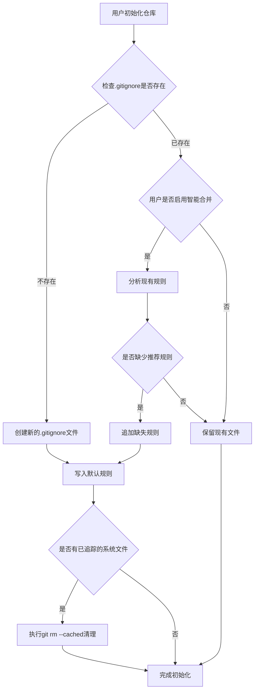

# 设计文档：系统文件自动忽略优化

## 概述

本设计文档描述了如何在Chronos时光库中实现系统文件自动忽略功能。该功能将在用户初始化仓库时自动创建或更新`.gitignore`文件，确保常见的系统文件（如`.DS_Store`、`Thumbs.db`等）不被Git追踪，从而避免这些文件的动态变化影响版本控制和回滚功能。

## 架构

### 组件关系

```
GitWrapper (backend/services/git_wrapper.py)
    ↓
    ├─ init_repository() - 初始化仓库入口
    ↓
    ├─ _create_or_update_gitignore() - 创建/更新.gitignore
    ↓
    ├─ _get_default_gitignore_rules() - 获取默认规则
    ↓
    └─ _cleanup_tracked_system_files() - 清理已追踪的系统文件
```

### 执行流程



## 组件和接口

### 1. GitWrapper类扩展

#### 新增方法

##### `_create_or_update_gitignore()`
```python
def _create_or_update_gitignore(self, merge_mode: bool = False) -> Dict[str, Any]:
    """
    创建或更新.gitignore文件
    
    Args:
        merge_mode: 是否启用智能合并模式
        
    Returns:
        操作结果字典，包含：
        - created: bool - 是否创建了新文件
        - updated: bool - 是否更新了现有文件
        - rules_added: List[str] - 添加的规则列表
    """
```

##### `_get_default_gitignore_rules()`
```python
def _get_default_gitignore_rules(self) -> List[str]:
    """
    获取默认的.gitignore规则列表
    
    Returns:
        规则字符串列表，按类别分组
    """
```

##### `_cleanup_tracked_system_files()`
```python
def _cleanup_tracked_system_files(self) -> List[str]:
    """
    清理已被追踪的系统文件
    
    Returns:
        被清理的文件路径列表
    """
```

##### `_is_system_file(filename: str)`
```python
@staticmethod
def _is_system_file(filename: str) -> bool:
    """
    判断文件是否为系统文件
    
    Args:
        filename: 文件路径
        
    Returns:
        True如果是系统文件，否则False
    """
```

### 2. .chronos配置文件扩展

在现有的`.chronos`配置文件中添加新的配置项：

```json
{
  "version": "1.0",
  "created_at": "2025-10-21T...",
  "user": {
    "name": "...",
    "email": "..."
  },
  "settings": {
    "auto_stage": true,
    "default_branch": "main",
    "gitignore": {
      "auto_create": true,
      "smart_merge": false,
      "custom_rules": [],
      "enabled_categories": ["macos", "windows", "linux", "ide"]
    }
  }
}
```

## 数据模型

### GitIgnore规则分类

```python
GITIGNORE_RULES = {
    "macos": [
        ".DS_Store",
        ".AppleDouble",
        ".LSOverride",
        "._*",
        ".DocumentRevisions-V100",
        ".fseventsd",
        ".Spotlight-V100",
        ".TemporaryItems",
        ".Trashes",
        ".VolumeIcon.icns",
        ".com.apple.timemachine.donotpresent"
    ],
    "windows": [
        "Thumbs.db",
        "Thumbs.db:encryptable",
        "ehthumbs.db",
        "ehthumbs_vista.db",
        "*.stackdump",
        "[Dd]esktop.ini",
        "$RECYCLE.BIN/",
        "*.lnk"
    ],
    "linux": [
        "*~",
        ".fuse_hidden*",
        ".directory",
        ".Trash-*",
        ".nfs*"
    ],
    "ide": [
        ".vscode/",
        ".idea/",
        "*.swp",
        "*.swo",
        "*.swn",
        ".project",
        ".classpath",
        ".settings/"
    ]
}
```

### 系统文件检测模式

```python
SYSTEM_FILE_PATTERNS = [
    r'^\.DS_Store$',
    r'^Thumbs\.db$',
    r'^\..*~$',
    r'^\.vscode/',
    r'^\.idea/',
    r'.*\.swp$',
    # ... 更多模式
]
```

## 错误处理

### 异常类型

1. **FilePermissionError** - 无法创建或修改.gitignore文件
2. **GitError** - Git命令执行失败（如git rm --cached）

### 错误处理策略

```python
try:
    self._create_or_update_gitignore()
except PermissionError:
    # 记录警告，但不阻止初始化流程
    logger.warning("无法创建.gitignore文件：权限不足")
    return {"success": True, "warning": "无法创建.gitignore文件"}
except GitError as e:
    # 清理失败不影响初始化
    logger.error(f"清理系统文件失败: {e}")
    return {"success": True, "warning": "部分系统文件清理失败"}
```

## 测试策略

### 单元测试

#### 测试用例1：创建新的.gitignore文件
```python
def test_create_gitignore_new_repository():
    """测试在新仓库中创建.gitignore文件"""
    # 初始化仓库
    # 验证.gitignore文件存在
    # 验证包含所有默认规则
```

#### 测试用例2：保留现有.gitignore文件
```python
def test_preserve_existing_gitignore():
    """测试保留用户已有的.gitignore文件"""
    # 创建自定义.gitignore文件
    # 初始化仓库
    # 验证文件内容未被修改
```

#### 测试用例3：智能合并模式
```python
def test_smart_merge_gitignore():
    """测试智能合并模式补充规则"""
    # 创建部分规则的.gitignore
    # 启用智能合并模式初始化
    # 验证缺失规则被追加
    # 验证原有规则未被修改
```

#### 测试用例4：清理已追踪的系统文件
```python
def test_cleanup_tracked_system_files():
    """测试清理已追踪的系统文件"""
    # 创建并追踪.DS_Store文件
    # 初始化仓库
    # 验证文件不再被追踪
    # 验证文件仍存在于工作目录
```

#### 测试用例5：系统文件检测
```python
def test_is_system_file():
    """测试系统文件检测功能"""
    assert _is_system_file('.DS_Store') == True
    assert _is_system_file('Thumbs.db') == True
    assert _is_system_file('normal_file.txt') == False
```

### 集成测试

#### 测试场景1：完整初始化流程
```python
def test_full_initialization_with_gitignore():
    """测试包含.gitignore创建的完整初始化流程"""
    # 初始化仓库
    # 验证.gitignore存在
    # 创建系统文件
    # 验证系统文件不在git status中
```

#### 测试场景2：跨平台兼容性
```python
def test_cross_platform_gitignore():
    """测试.gitignore在不同平台的兼容性"""
    # 验证包含所有平台的规则
    # 验证规则格式正确
```

## 实现细节

### 1. 默认.gitignore模板

```gitignore
# Chronos时光库 - 自动生成的忽略规则
# 生成时间: {timestamp}

# macOS系统文件
.DS_Store
.AppleDouble
.LSOverride
._*

# Windows系统文件
Thumbs.db
Desktop.ini
$RECYCLE.BIN/

# Linux系统文件
*~
.directory
.Trash-*

# IDE配置文件
.vscode/
.idea/
*.swp
*.swo

# 日志文件
*.log

# 临时文件
*.tmp
*.temp
```

### 2. 智能合并逻辑

```python
def _merge_gitignore_rules(existing_content: str, new_rules: List[str]) -> str:
    """
    智能合并.gitignore规则
    
    1. 解析现有规则（忽略注释和空行）
    2. 识别缺失的推荐规则
    3. 在文件末尾追加缺失规则
    4. 添加分隔注释
    """
    existing_rules = set()
    for line in existing_content.splitlines():
        line = line.strip()
        if line and not line.startswith('#'):
            existing_rules.add(line)
    
    missing_rules = [rule for rule in new_rules if rule not in existing_rules]
    
    if missing_rules:
        merged_content = existing_content.rstrip() + '\n\n'
        merged_content += '# Added by Chronos\n'
        merged_content += '\n'.join(missing_rules) + '\n'
        return merged_content
    
    return existing_content
```

### 3. 系统文件清理

```python
def _cleanup_tracked_system_files(self) -> List[str]:
    """清理已追踪的系统文件"""
    # 获取所有已追踪文件
    tracked_files = self.get_tracked_files()
    
    # 筛选系统文件
    system_files = [f for f in tracked_files if self._is_system_file(f)]
    
    if not system_files:
        return []
    
    # 执行git rm --cached
    cleaned_files = []
    for file in system_files:
        try:
            self._run_git_command(['rm', '--cached', file])
            cleaned_files.append(file)
        except GitError:
            # 单个文件失败不影响其他文件
            continue
    
    return cleaned_files
```

## 性能考虑

1. **文件I/O优化**：
   - 一次性读取和写入.gitignore文件
   - 避免多次文件操作

2. **规则匹配优化**：
   - 使用集合（set）进行规则去重
   - 预编译正则表达式模式

3. **批量清理**：
   - 尽可能使用单个git命令清理多个文件
   - 如果支持，使用`git rm --cached file1 file2 file3`

## 向后兼容性

1. **配置文件兼容**：
   - 新的`gitignore`配置项为可选
   - 如果不存在，使用默认值
   - 旧版本的`.chronos`文件仍然有效

2. **行为兼容**：
   - 默认行为：自动创建.gitignore（`auto_create: true`）
   - 不影响已有仓库的.gitignore文件
   - 用户可以通过配置禁用此功能

## 用户体验

### 初始化成功消息

```json
{
  "success": true,
  "message": "时光库初始化成功",
  "gitignore": {
    "created": true,
    "rules_count": 25,
    "cleaned_files": [".DS_Store"]
  }
}
```

### 日志输出

```
INFO: 正在初始化时光库...
INFO: 创建.gitignore文件...
INFO: 添加25条忽略规则
INFO: 检测到1个已追踪的系统文件
INFO: 清理系统文件: .DS_Store
INFO: 时光库初始化完成
```

## 安全考虑

1. **路径验证**：
   - 验证.gitignore文件路径在仓库根目录内
   - 防止路径遍历攻击

2. **权限检查**：
   - 检查文件写入权限
   - 优雅处理权限错误

3. **内容验证**：
   - 验证自定义规则格式
   - 防止注入恶意内容

## 未来扩展

1. **UI配置界面**：
   - 在前端添加.gitignore配置页面
   - 允许用户可视化选择规则类别

2. **规则模板库**：
   - 提供更多语言和框架的.gitignore模板
   - 支持从GitHub的gitignore仓库导入

3. **智能建议**：
   - 根据项目文件类型自动推荐规则
   - 检测项目使用的技术栈并建议相应规则
