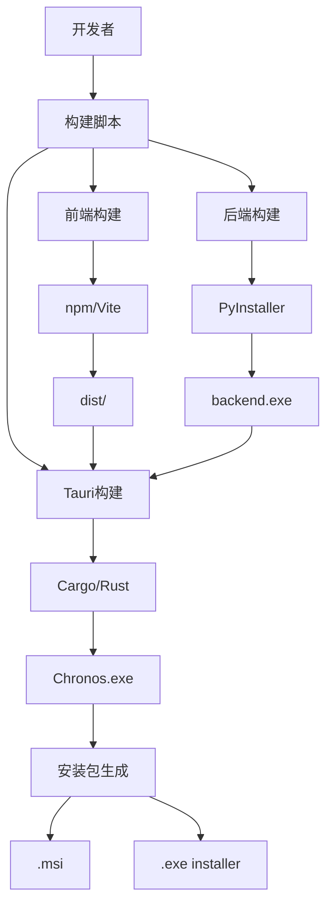

# Windows Build Support - 详细设计补充

## 1. 构建环境架构设计

### 1.1 Windows开发环境要求

```
Windows 10/11 (64-bit)
├── Python 3.10+ (64-bit)
│   ├── pip (最新版本)
│   ├── virtualenv
│   └── PyInstaller 5.0+
├── Node.js 18+ LTS
│   ├── npm 9+
│   └── 全局包: @tauri-apps/cli
├── Rust Toolchain
│   ├── rustc 1.70+
│   ├── cargo
│   └── MSVC Build Tools
├── Git for Windows 2.40+
│   ├── Git Bash
│   └── Git GUI (可选)
└── Visual Studio Build Tools 2019+
    ├── C++ Build Tools
    ├── Windows 10 SDK
    └── MSVC v142+
```

### 1.2 构建工具链依赖关系



## 2. Tauri配置深度设计

### 2.1 完整的Windows配置结构

```json
{
  "$schema": "https://schema.tauri.app/config/2",
  "productName": "Chronos",
  "version": "1.1.0",
  "identifier": "com.chronos.app",
  
  "build": {
    "beforeDevCommand": "npm run dev",
    "devUrl": "http://localhost:5173",
    "beforeBuildCommand": "npm run build",
    "frontendDist": "../dist"
  },
  
  "bundle": {
    "active": true,
    "targets": ["msi", "nsis"],
    "icon": [
      "icons/32x32.png",
      "icons/128x128.png",
      "icons/128x128@2x.png",
      "icons/icon.icns",
      "icons/icon.ico"
    ],
    "resources": ["binaries/*"],
    "externalBin": ["binaries/backend"],
    
    "windows": {
      "certificateThumbprint": null,
      "digestAlgorithm": "sha256",
      "timestampUrl": "",
      "tsp": false,
      "wix": {
        "language": "zh-CN",
        "template": null,
        "fragmentPaths": [],
        "componentRefs": [],
        "featureGroupRefs": [],
        "featureRefs": [],
        "mergeRefs": [],
        "skipWebviewInstall": false,
        "license": null,
        "enableElevatedUpdateTask": false,
        "bannerPath": null,
        "dialogImagePath": null
      },
      "nsis": {
        "license": null,
        "headerImage": null,
        "sidebarImage": null,
        "installerIcon": null,
        "installMode": "currentUser",
        "languages": ["SimpChinese"],
        "displayLanguageSelector": false
      }
    }
  },
  
  "app": {
    "windows": [
      {
        "fullscreen": false,
        "resizable": true,
        "title": "Chronos - 文件时光机",
        "width": 1200,
        "height": 800,
        "minWidth": 800,
        "minHeight": 600,
        "center": true,
        "decorations": true,
        "transparent": false,
        "alwaysOnTop": false,
        "skipTaskbar": false
      }
    ],
    "security": {
      "csp": null
    }
  }
}
```

### 2.2 配置项设计说明

**Windows特定配置解析**:

1. **certificateThumbprint**: 代码签名证书指纹
   - 生产环境应配置有效证书
   - 开发环境可为null
   - 避免SmartScreen警告

2. **wix配置** (用于.msi安装包):
   - `language`: 设置为"zh-CN"支持中文界面
   - `skipWebviewInstall`: false确保安装WebView2
   - `enableElevatedUpdateTask`: false避免需要管理员权限

3. **nsis配置** (用于.exe安装程序):
   - `installMode`: "currentUser"不需要管理员权限
   - `languages`: ["SimpChinese"]简体中文界面
   - `displayLanguageSelector`: false单一语言不显示选择器

## 3. PyInstaller配置深度设计

### 3.1 backend.spec完整配置

```python
# -*- mode: python ; coding: utf-8 -*-
import sys
import os
from PyInstaller.utils.hooks import collect_data_files, collect_submodules

# 收集FastAPI和Uvicorn的所有子模块
hiddenimports = [
    'uvicorn.logging',
    'uvicorn.loops',
    'uvicorn.loops.auto',
    'uvicorn.protocols',
    'uvicorn.protocols.http',
    'uvicorn.protocols.http.auto',
    'uvicorn.protocols.websockets',
    'uvicorn.protocols.websockets.auto',
    'uvicorn.lifespan',
    'uvicorn.lifespan.on',
    'fastapi',
    'pydantic',
    'starlette',
]

# 收集数据文件
datas = [
    ('main.py', '.'),
]

# 分析阶段
a = Analysis(
    ['main.py'],
    pathex=[],
    binaries=[],
    datas=datas,
    hiddenimports=hiddenimports,
    hookspath=[],
    hooksconfig={},
    runtime_hooks=[],
    excludes=[
        'tkinter',
        'matplotlib',
        'numpy',
        'pandas',
    ],
    win_no_prefer_redirects=False,
    win_private_assemblies=False,
    cipher=None,
    noarchive=False,
)

# PYZ归档
pyz = PYZ(a.pure, a.zipped_data, cipher=None)

# 可执行文件配置
exe = EXE(
    pyz,
    a.scripts,
    a.binaries,
    a.zipfiles,
    a.datas,
    [],
    name='backend',
    debug=False,
    bootloader_ignore_signals=False,
    strip=False,
    upx=True,
    upx_exclude=[],
    runtime_tmpdir=None,
    console=False,  # Windows下不显示控制台
    disable_windowed_traceback=False,
    argv_emulation=False,
    target_arch=None,
    codesign_identity=None,
    entitlements_file=None,
    icon='icon.ico' if os.path.exists('icon.ico') else None,
)
```

### 3.2 PyInstaller打包策略

**单文件 vs 单目录模式**:

| 特性 | 单文件模式 | 单目录模式 |
|------|-----------|-----------|
| 启动速度 | 较慢（需解压） | 较快 |
| 文件数量 | 1个exe | 多个文件 |
| 体积 | 较大 | 较小 |
| 推荐场景 | 最终发布 | 开发测试 |

**设计决策**: 使用单文件模式（`--onefile`）
- 简化Tauri集成
- 用户体验更好
- 便于分发

## 4. 路径处理深度设计

### 4.1 跨平台路径抽象层

```python
# backend/utils/path_handler.py (设计概念)

import os
import platform
from pathlib import Path
from typing import Union

class CrossPlatformPath:
    """跨平台路径处理器"""
    
    def __init__(self, path: Union[str, Path]):
        self.path = Path(path).resolve()
        self.platform = platform.system()
    
    def to_posix(self) -> str:
        """转换为POSIX格式（Git兼容）"""
        return self.path.as_posix()
    
    def to_native(self) -> str:
        """转换为原生格式"""
        return str(self.path)
    
    def is_valid(self) -> bool:
        """验证路径有效性"""
        try:
            # 检查路径是否存在
            if not self.path.exists():
                return False
            
            # 检查读写权限
            if not os.access(self.path, os.R_OK | os.W_OK):
                return False
            
            return True
        except (OSError, PermissionError):
            return False
    
    def normalize_for_git(self) -> str:
        """标准化为Git命令使用的格式"""
        # Git在Windows上接受正斜杠
        posix_path = self.to_posix()
        
        # 处理特殊字符（空格、中文等）
        # Git会自动处理，但我们需要确保路径被正确引用
        if ' ' in posix_path or self._contains_non_ascii(posix_path):
            return f'"{posix_path}"'
        
        return posix_path
    
    @staticmethod
    def _contains_non_ascii(s: str) -> bool:
        """检查字符串是否包含非ASCII字符"""
        return not all(ord(c) < 128 for c in s)
```

### 4.2 路径处理场景矩阵

| 场景 | Windows输入 | 处理方式 | Git命令格式 |
|------|------------|---------|------------|
| 普通路径 | `C:\Users\test` | `Path().resolve()` | `C:/Users/test` |
| 含空格 | `C:\Program Files` | 添加引号 | `"C:/Program Files"` |
| 中文路径 | `C:\用户\文档` | UTF-8编码 | `"C:/用户/文档"` |
| 相对路径 | `..\folder` | 转绝对路径 | `C:/absolute/path` |
| UNC路径 | `\\server\share` | 保持原样 | `//server/share` |

## 5. 进程管理设计

### 5.1 后端进程生命周期

```
[Tauri启动]
    ↓
[检测backend.exe]
    ↓
[启动backend进程] (subprocess)
    ↓
[等待服务就绪] (健康检查)
    ↓
[前端连接后端] (HTTP: 127.0.0.1:8765)
    ↓
[正常运行]
    ↓
[Tauri关闭]
    ↓
[优雅关闭backend] (SIGTERM)
    ↓
[清理资源]
```

### 5.2 进程通信设计

**健康检查机制**:
```typescript
// frontend/src/utils/backend-health.ts (设计概念)

interface HealthCheckConfig {
  url: string;
  timeout: number;
  maxRetries: number;
  retryDelay: number;
}

async function waitForBackend(config: HealthCheckConfig): Promise<boolean> {
  for (let i = 0; i < config.maxRetries; i++) {
    try {
      const response = await fetch(`${config.url}/health`, {
        method: 'GET',
        signal: AbortSignal.timeout(config.timeout),
      });
      
      if (response.ok) {
        return true;
      }
    } catch (error) {
      // 等待后重试
      await new Promise(resolve => setTimeout(resolve, config.retryDelay));
    }
  }
  
  return false;
}
```

## 6. 编码和本地化设计

### 6.1 字符编码处理

**Windows编码问题**:
- 默认代码页: GBK (中文Windows)
- Git输出: UTF-8
- Python默认: UTF-8 (Python 3.7+)
- 文件系统: UTF-16LE (NTFS)

**统一编码策略**:
```python
# 所有subprocess调用统一使用UTF-8
result = subprocess.run(
    ["git", "status"],
    cwd=repo_path,
    capture_output=True,
    text=True,
    encoding='utf-8',
    errors='replace',  # 替换无法解码的字符
)

# 文件读写统一使用UTF-8
with open(file_path, 'r', encoding='utf-8') as f:
    content = f.read()
```

### 6.2 用户界面本地化

**中文界面元素**:
```typescript
// frontend/src/i18n/zh-CN.ts (设计概念)

export const zhCN = {
  app: {
    title: 'Chronos - 文件时光机',
  },
  errors: {
    gitNotFound: '未检测到Git，请从以下地址下载安装：\nhttps://git-scm.com/download/win',
    pathInvalid: '路径无效或无法访问',
    permissionDenied: '权限不足，请检查文件夹权限或以管理员身份运行',
  },
  // ...
};
```

## 7. 错误处理和日志设计

### 7.1 分层错误处理

```
[用户操作]
    ↓
[Frontend错误捕获]
    ├─ UI错误提示
    └─ 错误日志记录
    ↓
[Backend错误处理]
    ├─ Git错误解析
    ├─ 路径错误处理
    └─ 权限错误处理
    ↓
[系统级错误]
    ├─ 进程崩溃恢复
    └─ 资源清理
```

### 7.2 日志系统设计

**日志级别和输出**:
```python
# backend/utils/logger.py (设计概念)

import logging
import sys
from pathlib import Path

def setup_logger(name: str, log_file: Path = None) -> logging.Logger:
    """配置日志系统"""
    logger = logging.getLogger(name)
    logger.setLevel(logging.INFO)
    
    # 控制台处理器（开发环境）
    console_handler = logging.StreamHandler(sys.stdout)
    console_handler.setLevel(logging.DEBUG)
    
    # 文件处理器（生产环境）
    if log_file:
        file_handler = logging.FileHandler(
            log_file,
            encoding='utf-8',
            mode='a'
        )
        file_handler.setLevel(logging.INFO)
        logger.addHandler(file_handler)
    
    # 格式化
    formatter = logging.Formatter(
        '%(asctime)s - %(name)s - %(levelname)s - %(message)s',
        datefmt='%Y-%m-%d %H:%M:%S'
    )
    console_handler.setFormatter(formatter)
    
    logger.addHandler(console_handler)
    return logger
```

**Windows日志位置**:
- 开发环境: 控制台输出
- 生产环境: `%APPDATA%\Chronos\logs\app.log`

## 8. 性能优化设计

### 8.1 启动性能优化

**优化策略**:
1. **延迟加载**: 非核心模块延迟导入
2. **并行启动**: 前端和后端并行初始化
3. **缓存预热**: 预加载常用Git配置
4. **资源压缩**: 压缩前端资源

**启动时间目标**:
- 冷启动: < 3秒
- 热启动: < 1秒

### 8.2 运行时性能优化

**Git命令优化**:
```python
# 批量操作代替多次调用
# 不推荐:
for file in files:
    git.add(file)

# 推荐:
git.add(files)  # 一次性添加所有文件
```

**缓存策略**:
- 分支列表缓存（5秒）
- 文件状态缓存（1秒）
- 提交历史缓存（10秒）

## 9. 安全设计

### 9.1 输入验证

**路径注入防护**:
```python
def validate_path(path: str) -> bool:
    """验证路径安全性"""
    # 禁止的字符和模式
    forbidden_patterns = [
        '..',  # 目录遍历
        '~',   # 用户目录
        '$',   # 环境变量
    ]
    
    for pattern in forbidden_patterns:
        if pattern in path:
            return False
    
    # 确保路径在允许的范围内
    resolved = Path(path).resolve()
    # 检查是否在用户目录下
    user_home = Path.home()
    try:
        resolved.relative_to(user_home)
        return True
    except ValueError:
        return False
```

### 9.2 进程隔离

**沙箱设计**:
- Backend进程独立运行
- 限制文件系统访问范围
- 不访问系统敏感目录
- 不需要管理员权限

## 10. 测试设计

### 10.1 自动化测试架构

```
测试金字塔
    ↑
[E2E测试] (10%)
    ├─ 安装测试
    ├─ 启动测试
    └─ 核心流程测试
    ↑
[集成测试] (30%)
    ├─ API测试
    ├─ Git集成测试
    └─ 路径处理测试
    ↑
[单元测试] (60%)
    ├─ 工具函数测试
    ├─ 组件测试
    └─ 服务测试
```

### 10.2 Windows特定测试用例

**路径测试矩阵**:
```python
test_cases = [
    # (输入路径, 预期结果, 描述)
    (r"C:\Users\test", True, "标准路径"),
    (r"C:\Program Files\App", True, "含空格路径"),
    (r"C:\用户\文档", True, "中文路径"),
    (r"\\server\share", True, "UNC路径"),
    (r"C:\test\..\escape", False, "目录遍历"),
    (r"C:\Windows\System32", False, "系统目录"),
]
```

## 11. 部署和分发设计

### 11.1 安装包结构

**.msi安装包内容**:
```
Chronos.msi
├── Chronos.exe (主程序)
├── backend.exe (Python后端)
├── WebView2Loader.dll
├── resources/
│   ├── icons/
│   └── locales/
└── uninstall.exe
```

### 11.2 安装流程设计

```
[用户下载.msi]
    ↓
[运行安装程序]
    ↓
[选择安装位置] (默认: %LOCALAPPDATA%\Chronos)
    ↓
[检查依赖] (WebView2)
    ├─ 已安装 → 继续
    └─ 未安装 → 自动下载安装
    ↓
[复制文件]
    ↓
[创建快捷方式]
    ├─ 桌面
    └─ 开始菜单
    ↓
[注册卸载程序]
    ↓
[完成安装]
```

## 12. 维护和更新设计

### 12.1 版本管理策略

**语义化版本**:
- 主版本号: 重大架构变更
- 次版本号: 新功能添加
- 修订号: Bug修复

**Windows版本标识**:
```
Chronos v1.1.0-windows-x64
         │ │ │    │       │
         │ │ │    │       └─ 架构
         │ │ │    └─ 平台
         │ │ └─ 修订号
         │ └─ 次版本号
         └─ 主版本号
```

### 12.2 更新机制设计

**检查更新流程**:
```
[应用启动]
    ↓
[后台检查更新] (非阻塞)
    ↓
[对比版本号]
    ├─ 有新版本 → 显示通知
    └─ 无新版本 → 继续运行
    ↓
[用户选择]
    ├─ 立即更新 → 下载安装包
    ├─ 稍后提醒 → 下次启动再提示
    └─ 忽略此版本 → 记录配置
```

## 总结

本设计文档详细描述了Chronos Windows版本的技术架构和实现策略。关键设计决策包括：

1. **在Windows环境构建**: 避免交叉编译复杂性
2. **使用pathlib.Path**: 确保跨平台路径兼容
3. **PyInstaller单文件打包**: 简化部署和集成
4. **UTF-8统一编码**: 解决Windows编码问题
5. **不需要管理员权限**: 提升用户体验
6. **完善的错误处理**: 提供友好的错误提示
7. **性能优化**: 确保流畅的用户体验

后续在Windows环境实施时，可以参考本设计文档进行开发和测试。
