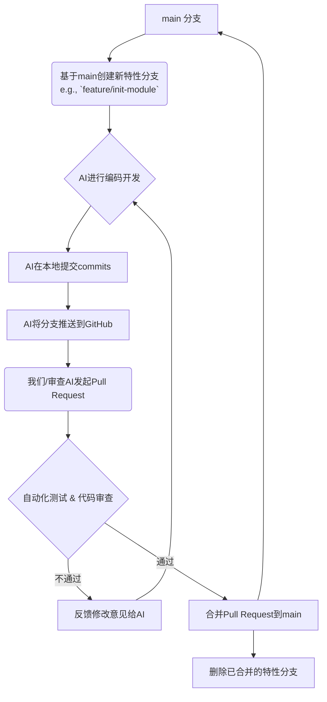

# 项目管理与AI协作指南: Chronos v0.1

## 1. 项目概述
本文档旨在为Chronos MVP项目的开发、测试和管理提供一套清晰的框架和流程。其核心目标是确保项目高效、高质量地进行，特别是在与AI开发者（如Claude）协作的模式下。

## 2. 核心原则
- **迭代开发**: 我们采用小步快跑的迭代模式。先搭建骨架，再填充细节，最后打磨体验。
- **文档驱动**: `PRD.md`是需求的唯一来源，`tech_spec.md`是技术实现的唯一依据。
- **自动化优先**: 尽可能地利用自动化工具（Linter, Formatter, Tester）来保障代码质量，减少人工审查成本。
- **清晰沟通**: 尤其是在与AI协作时，使用结构化的指令和明确的验收标准至关重要。

## 3. 开发工作流
我们将遵循一个基于Git分支的简单而高效的工作流。



## 4. AI协作指令模板 (Prompt Engineering)

为了让AI开发者能精确、高效地完成任务，我们将使用统一的、结构化的指令模板来分配任务。

### 4.1. 新功能开发指令模板

```markdown
**角色**: 你是一位资深的Python后端/React前端开发者。
**项目背景**: 我们正在开发一款名为Chronos的本地文件版本管理工具。它的核心是通过封装Git命令行，为用户提供图形化界面。项目技术栈为[Python/FastAPI | React/Tauri]。

**核心文档**:
- PRD: `vibecoding/PRD.md`
- 技术规格: `vibecoding/tech_spec.md`

---

**任务**: 实现 `[PRD中的功能模块名称]` 功能。

**具体要求**:
1.  **后端**:
    -   请根据 `tech_spec.md` 中定义的 `[API端点路径，如 /repository/init]` 接口，在 `[指定的文件路径，如 backend/main.py]` 中完成其逻辑实现。
    -   你需要调用 `subprocess` 模块来执行 `[具体的git命令]`。
    -   你需要仔细地解析命令的输出，并组装成 `tech_spec.md` 中定义的JSON数据结构返回。
    -   请为该接口编写单元测试，存放于 `[指定的测试文件路径]`，确保能覆盖正常及异常的返回情况。
2.  **前端**:
    -   请在 `[指定的组件路径，如 frontend/src/components/]` 下创建名为 `[组件名].tsx` 的React组件。
    -   该组件需要实现 `PRD.md` 中描述的交互逻辑和 `tech_spec.md` 中定义的API调用。
    -   请使用Ant Design组件库来构建UI，并参考PRD中的线框图布局。
    -   你需要处理API调用的加载(loading)和错误(error)状态，并给予用户清晰的UI反馈。

**验收标准 (Checklist)**:
- [ ] 后端代码是否遵循Black和Ruff规范？
- [ ] 前端代码是否遵循Prettier和ESLint规范？
- [ ] 后端单元测试是否已编写并通过？
- [ ] 前端组件是否能正确渲染，且交互符合PRD描述？
- [ ] 是否已处理所有潜在的错误情况（如Git命令执行失败）？

请在完成后，将代码提交到一个名为 `feature/[功能简称]` 的新分支上，并告知我。
```

### 4.2. Bug修复指令模板
```markdown
**角色**: ... (同上)
**项目背景**: ... (同上)

---

**任务**: 修复Bug `[Bug的标题或Issue编号]`。

**Bug描述**:
[清晰地描述Bug现象、复现步骤、期望结果和实际结果]

**相关代码文件**:
- `[可能涉及的文件路径1]`
- `[可能涉及的文件路径2]`

**验收标准**:
- [ ] Bug是否已成功修复，且符合期望结果？
- [ ] 是否已为该Bug场景补充了新的单元测试，以防止未来再次出现？
- [ ] 代码是否依然遵循项目的代码规范？

请在完成后，将代码提交到一个名为 `fix/[问题简称]` 的新分支上，并告知我。
```

## 5. 代码验收标准 (Code Review Checklist)
这是我们在合并任何Pull Request之前，必须逐项检查的清单：
1.  **需求符合度**: 代码实现的功能是否与`PRD.md`中的描述完全一致？
2.  **设计符合度**: 代码架构、API设计是否遵循了`tech_spec.md`的规定？
3.  **代码质量**:
    - 代码是否已通过所有Linter和Formatter的检查？
    - 命名是否清晰、表意？
    - 是否有过于复杂、难以理解的逻辑？
4.  **测试完备度**:
    - 是否为新功能编写了足够的单元测试？
    - 所有测试是否都能成功通过？
5.  **文档与注释**:
    - 对于复杂的逻辑，是否有必要的注释？
    - 如果有API变更，相关文档是否已更新？
6.  **用户体验**:
    - UI交互是否流畅？
    - 加载和错误状态是否处理得当？

---

这份文档将作为我们与AI协作的“共同语言”和“行为准则”，确保整个开发过程的顺畅、高效和可控。
